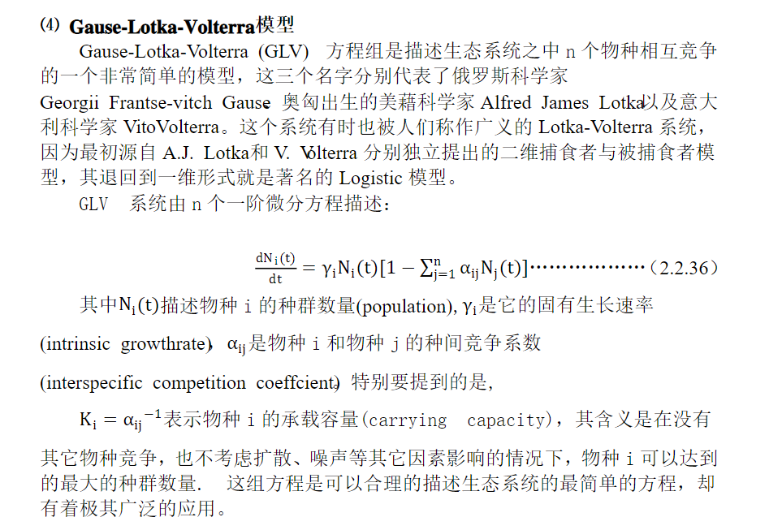

# Training Problem

## 1. Introduction

### Related Work

_Abstract 部分_

[url1](https://www.researchgate.net/publication/236463111_Sales_Prediction_with_Parametrized_Time_Series_Analysis)

### Model Overview

**在问题一中，我们用加法模式的时间序列模型模拟销售额变化。首先，通过时间-销售额图的初步分析判断，我们列举了可能的影响因素；其次，对每个因素分别选择加权移动平均法、季节趋势预测法、指数平滑法等适当的分析方法得到每个因素的参数；再次，通过线性回归模型拟合曲线，得到修正后的结果；最后，根据参数确定该因素与销售额的相关性，确定最终影响因素。**

**在问题二中，**

## 2. Assumptions and Notations

### Assumptions

```
>1.期间外界经济环境平稳没有动荡
>2.忽略付款方式及抹零的影响
>3.忽略季节因素的影响
>4.每个门店销售的水果种类一致且充足，打折优惠保持一致
```

## 3. Model Construction

### Additive Time Serious Model

#### 3.1.1 理由

##### time serious

Benefits & Applications of Time Series:

It helps to achieve various objectives:

> 1.  Descriptive Analysis: determines trends and patterns of future using graphs and other tools.
> 2.  Forecasting: It is used extensively in financial, business forecasting based on historical trends and patterns
> 3.  Explanative Analysis: to study cross-correlation/relationship between two time-series and their dependency on one another.

The biggest advantage of using time series analysis – It can be used to understand the past as well as predict the future.

> 1.  Temporal effects (that is, the effects of time passing) are literally everywhere in whatever you want to call “problem solving using data” (data science, machine learning, applied statistics…).
> 2.  Hypothetically speaking the “best” way to deal with temporal effects is time series analysis.
> 3.  As a practitioner, you work in of the hardest and most fascinating areas in what we do. Other data scientists have to deal with extrapolation from, e.g., covariate shift that is hypothetically detectable and often only happens in certain cases. When one is dealing with time, you’re looking at “How does one deal with events that may or may not occur?”, black and grey swan effects, and the like.
> 4.  Most machine learning algorithms don’t deal with time well. (Advantage if you like research and ripping algorithms apart and altering and adjusting for this kind of thing like I do.)

[url*ads*为什么选择时间序列](https://www.quora.com/What-is-time-series-analysis-What-are-its-advantages-and-disadvantages)

##### add

In a multiplicative time series, the components multiply together to make the time series. If you have an increasing trend, the amplitude of seasonal activity increases. Everything becomes more exaggerated. This is common when you’re looking at web traffic.

In an additive time series, the components add together to make the time series. If you have an increasing trend, you still see roughly the same size peaks and troughs throughout the time series. This is often seen in indexed time series where the absolute value is growing but changes stay relative.

_Additive model:_

> 1.  Data is represented in terms of addition of seasonality, trend, cyclical and residual components
> 2.  Used where change is measured in absolute quantity
> 3.  Data is modeled as-is

[url*ads*为什么选择加法模式 1](https://www.r-bloggers.com/is-my-time-series-additive-or-multiplicative/)

[url*ads*为什么选择加法模式 2](https://www.quora.com/What-are-the-differences-between-an-Additive-and-a-Multiplicative-Time-Series-model)

#### 3.1.2 公式

[url*ads*公式](https://wiki.mbalib.com/wiki/%E6%97%B6%E9%97%B4%E5%BA%8F%E5%88%97%E5%88%86%E8%A7%A3%E6%B3%95)

### Model 2

### ARIMA model

#### 理由

In statistics and econometrics, and in particular in time series analysis, an autoregressive integrated moving average (ARIMA) model is a generalization of an autoregressive moving average (ARMA) model. Both of these models are fitted to time series data either to better understand the data or to predict future points in the series (forecasting). ARIMA models are applied in some cases where data show evidence of non-stationarity, where an initial differencing step (corresponding to the "integrated" part of the model) can be applied one or more times to eliminate the non-stationarity.
The AR part of ARIMA indicates that the evolving variable of interest is regressed on its own lagged (i.e., prior) values. The MA part indicates that the regression error is actually a linear combination of error terms whose values occurred contemporaneously and at various times in the past. The I (for "integrated") indicates that the data values have been replaced with the difference between their values and the previous values (and this differencing process may have been performed more than once). The purpose of each of these features is to make the model fit the data as well as possible.

[url*arima*wiki](https://en.wikipedia.org/wiki/Autoregressive_integrated_moving_average#Software_implementations)

#### 公式

### Gause-Lotka-Volterra Model

#### 理由



#### 转化
